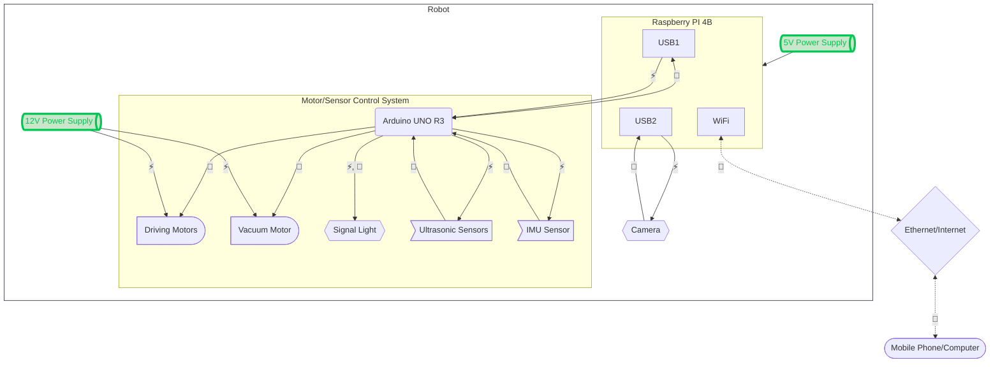

```mermaid
---
config:
  layout: dagre
---
flowchart TB
 subgraph s2["Raspberry PI 4B"]
        n3["WiFi"]
        n6["USB1"]
        n7["USB2"]
  end
 subgraph s1["Robot"]
        s2
        s3["s3"]
        n13["Camera"]
        n14["5V Power Supply"]
        n15["12V Power Supply"]
  end
 subgraph s3["Motor/Sensor Control System"]
        n5["Arduino UNO R3"]
        n8["Driving Motors"]
        n9["Vacuum Motor"]
        n10["Signal Light"]
        n11>"Ultrasonic Sensors"]
        n12>"IMU Sensor"]
  end
    n1["Ethernet/Internet"] <-. 📄 .-> n2["Mobile Phone/Computer"]
    n3 <-. 📄 .-> n1
    n6 <-- 📄 --> n5
    n5 -- 📄 --> n8 & n9
    n5 -- ⚡, 📄 --> n10
    n11 -- 📄 --> n5
    n5 -- ⚡ --> n11 & n12
    n12 -- 📄 --> n5
    n7 -- ⚡ --> n13
    n13 -- 📄 --> n7
    n6 -- "<span style=color:>⚡</span>" --> n5
    n14 --> s2
    n15 -- "<span style=color:>⚡</span>" --> n8 & n9

    n6@{ shape: rect}
    n7@{ shape: rect}
    n13@{ shape: hex}
    n14@{ shape: h-cyl}
    n15@{ shape: h-cyl}
    n5@{ shape: rounded}
    n8@{ shape: delay}
    n9@{ shape: delay}
    n10@{ shape: hex}
    n1@{ shape: decision}
    n2@{ shape: terminal}
     n14:::Power
     n15:::Power
    classDef Power fill:#C8E6C9, stroke-width:4px, stroke-dasharray:0, stroke:#00C853, color:#00C853
    style s1 fill:#ffffff,stroke:#28253D
```